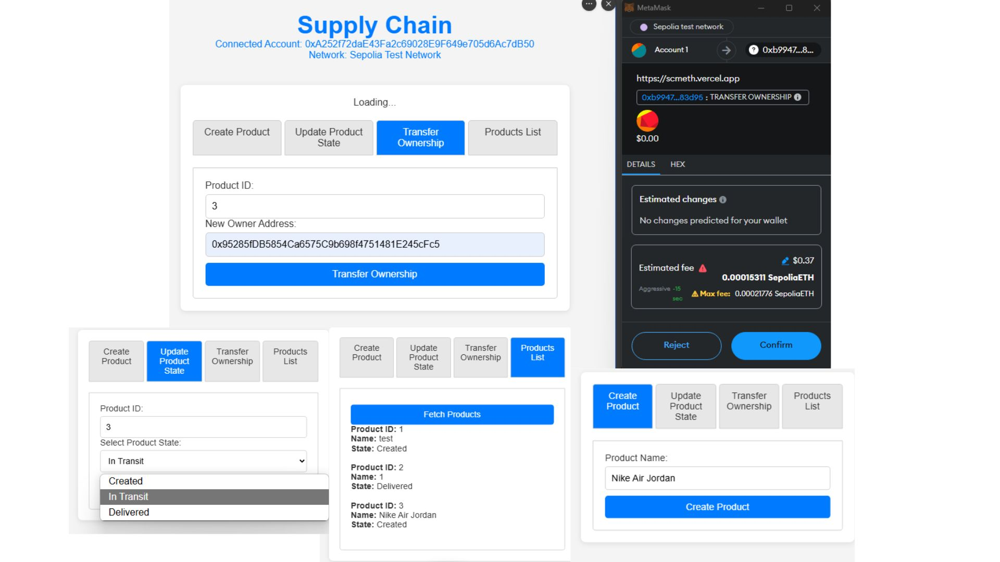

# Supply Chain Blockchain on Sepolia Testnet

## Overview

This project demonstrates a decentralized application (dApp) for supply chain management built on the Ethereum blockchain. It enables the creation, management, transfer ownership, and tracking of products in a transparent and secure manner, using blockchain technology to ensure data integrity.


---

## Features

- **Create Product**: Add new products with a unique ID and assign an owner.
- **Update Product State**: Change the state of products (e.g., Created, In Transit, Delivered).
- **View Product Details**: Retrieve detailed information about a product, including its current state and owner.
- **Transfer Ownership**: Ownership of a product can be transferred to another user by entering the product ID and the new owner's Ethereum address.
- **Frontend Interaction**: Simple web interface for interacting with the blockchain.

---

## Prerequisites

Ensure the following tools and accounts are set up:

1. **Node.js**: Install Node.js and npm for package management.
2. **MetaMask**: Install and configure MetaMask to connect to the blockchain. It will be used for all transactions and interactions with the smart contract on the testnet.
3. **Truffle Suite**: Install Truffle globally for Ethereum smart contract development.
4. **Infura Account**: Set up a project on Infura to connect with the Sepolia testnet.
5. **Sepolia Test ETH**: Obtain test Ether from a Sepolia faucet for deploying and interacting with the smart contract.

---

## Steps to Set Up the Project

### 1. Environment Setup

1. Install **Node.js** and **Truffle**.
2. Install **MetaMask** and add the Sepolia testnet configuration.
3. Create an **Infura Project** and copy the project ID for blockchain connectivity.

### 2. Initialize the Project

1. Create a new project directory and initialize a Truffle project.
2. Install the necessary dependencies, including the HDWalletProvider for connecting to the blockchain.

### 3. Configure Sepolia Network

1. Create a `.env` file and add your MetaMask seed phrase and Infura project ID:

   ```plaintext
   MNEMONIC=your_metamask_private_key
   INFURA_PROJECT_ID=your_infura_project_id
   ```

2. Update the Truffle configuration file (`truffle-config.js`) to include the Sepolia testnet settings.

### 4. Smart Contract Development

1. Create a smart contract to manage the supply chain workflow.
2. Compile the contract using Truffle.
3. Add a migration script to deploy the contract on the Sepolia testnet.

### 5. Deploy the Smart Contract

1. Connect to the Sepolia testnet using Infura and deploy the contract using Truffle.
2. Verify the deployment and note the contract address for frontend integration.

### 6. Frontend Development

1. Create a simple frontend using HTML, CSS, and JavaScript.
2. Integrate Web3.js to connect the frontend with the Ethereum blockchain.
3. Add functionality to:
   - Create a product.
   - Update product states.
   - View product details.
   - Transfer ownership of products.

### 7. Run the Application

1. Serve the frontend using a lightweight HTTP server such as **lite-server**.
2. Open the application in a browser and connect it to MetaMask.
3. Interact with the deployed smart contract via the frontend using MetaMask for transaction confirmation.

### 8. Testing and Verification

1. Test the contract functionality locally using Ganache.
2. Verify interactions on the Sepolia testnet using a blockchain explorer like [Etherscan for Sepolia](https://sepolia.etherscan.io).

### 9. Deployment

1. Deploy the frontend on a hosting platform like **Vercel**, **Netlify**, or **GitHub Pages**.
2. Share the deployed application URL for easy access.

---

## Conclusion

This project provides hands-on experience with blockchain development, including smart contract creation, Ethereum dApp integration, and interaction with the Sepolia testnet. It highlights the practical use of blockchain technology for enhancing supply chain transparency and efficiency.